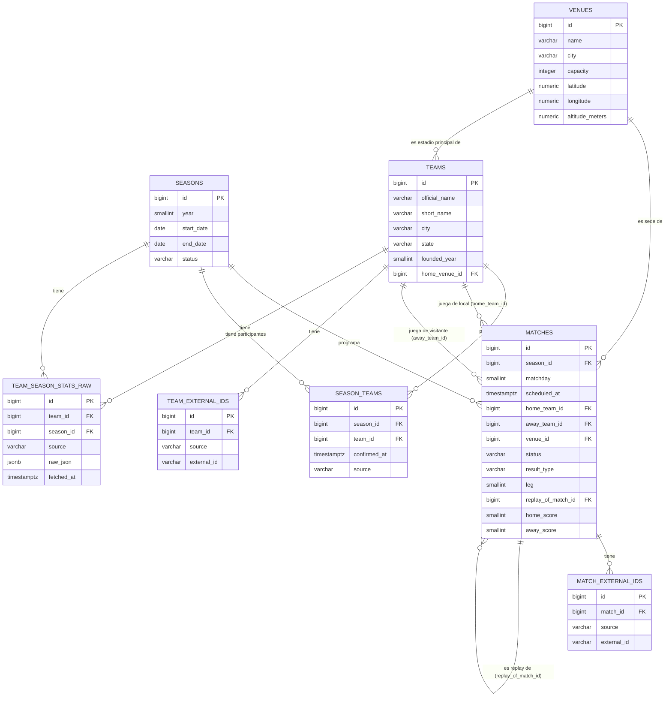

# Esquema Core de Base de Datos — Paso 1.1

## Alcance

Este documento define únicamente las tablas **fundacionales** del esquema relacional:
`teams`, `seasons`, `venues`, `matches`, más `season_teams` (participantes confirmados por
temporada) y dos tablas de soporte para el mapeo de IDs externos (`team_external_ids`,
`match_external_ids`) que surgen de una decisión de diseño explicada abajo. **No** es el
esquema completo de 8 capas del plan maestro — el resto se agrega en fases posteriores a
medida que se ingieren esos datos (clima, distancias, cuotas, features, etc.).

> Este documento incluye una ronda de revisión: las preguntas originales quedaron
> resueltas y estas versiones de las tablas ya reflejan esas decisiones (ver
> "Decisiones finales" al final).

Este diseño ya está implementado: los modelos SQLAlchemy viven en `src/data/models.py` y la
migración inicial en `alembic/versions/` (Paso 1.2). El script de validación de sanity
checks sobre estas tablas es Paso 1.3.

> **Enmienda de Paso 2.1**: al bootstrapear datos históricos desde el dataset de GitHub
> (`adaoduque/Brasileirao_Dataset`) se descubrió que ese dataset no trae ciudad exacta para
> equipos ni estadios, solo la UF (unidad federativa) del club. Se aplicó una migración
> incremental (no se tocó la migración inicial ya corrida) que vuelve nullable `teams.city` y
> `venues.city`, y agrega `teams.state` (VARCHAR(2)) para guardar la UF. Las tablas abajo ya
> reflejan este cambio.

> **Enmienda de Paso 2.3**: se agregó `team_season_stats_raw` (otra migración incremental)
> para guardar el JSON crudo de estadísticas agregadas de equipo por temporada de
> API-Football, sin normalizar a columnas todavía. Ver esa tabla más abajo para la
> justificación completa.

## Resolución de IDs externos multi-fuente

**Decisión: tabla separada (`team_external_ids`, `match_external_ids`) en vez de columnas
dedicadas (`fd_org_id`, `api_football_id`, ...) en `teams`/`matches`.**

Justificación: agregar una columna por fuente (`fd_org_id`, `api_football_id`,
`odds_api_id`, ...) funciona con dos fuentes, pero el plan maestro ya prevé sumar The Odds
API en Fase 3 y no descarta scraping puntual más adelante — cada fuente nueva implicaría una
migración de Alembic para agregar una columna a una tabla core, con el riesgo de dejar
columnas NULL en cascada para todos los registros históricos que no tengan esa fuente. Una
tabla de mapeo (`entity_id, source, external_id`) permite sumar fuentes sin tocar el esquema
de `teams`/`matches`, soporta que una fuente todavía no tenga ID asignado para una entidad
sin ensuciar la tabla principal con NULLs, y además sirve como registro auditable de
"de dónde salió este ID" (útil para depurar inconsistencias entre fuentes en Fase 2.4). El
costo es un JOIN extra al resolver un ID externo → entidad interna, que es aceptable dado que
no es una operación de path caliente (se usa en ingesta, no en serving de predicciones).

## Tablas

### `teams`

| Columna | Tipo | Nullable | Key | Descripción |
|---|---|---|---|---|
| `id` | BIGINT | NO | PK | Identificador interno, generado por la base. |
| `official_name` | VARCHAR(150) | NO | | Nombre oficial completo del club (ej. "Sport Club Corinthians Paulista"). |
| `short_name` | VARCHAR(50) | NO | | Nombre corto/popular usado en tablas y UI (ej. "Corinthians"). |
| `city` | VARCHAR(100) | YES | | Ciudad sede del club. Nullable desde Fase 2.1: el bootstrap histórico (dataset de GitHub) no trae nombre de ciudad, solo UF — se completa cuando ingerimos football-data.org/API-Football (2.2/2.3) o geocoding (Fase 3). |
| `state` | VARCHAR(2) | YES | | UF (unidad federativa) del club, ej. "SP", "RJ". Agregada en Fase 2.1 porque el dataset de bootstrap sí trae esto, a diferencia de la ciudad exacta. |
| `founded_year` | SMALLINT | YES | | Año de fundación, si está disponible en la fuente. |
| `home_venue_id` | BIGINT | YES | FK → `venues.id` | Estadio principal. Nullable porque puede no conocerse al momento de crear el equipo. |

### `team_external_ids`

| Columna | Tipo | Nullable | Key | Descripción |
|---|---|---|---|---|
| `id` | BIGINT | NO | PK | Identificador interno del mapeo. |
| `team_id` | BIGINT | NO | FK → `teams.id` | Equipo interno al que corresponde este ID externo. |
| `source` | VARCHAR(30) | NO | | Fuente externa: `football_data_org`, `api_football`, `odds_api`, etc. |
| `external_id` | VARCHAR(50) | NO | | ID del equipo tal como lo expone esa fuente. Se guarda como texto porque no todas las fuentes usan enteros. |

Constraints: `UNIQUE(team_id, source)` (un equipo tiene a lo sumo un ID por fuente),
`UNIQUE(source, external_id)` (un ID de una fuente dada mapea a un único equipo interno).

### `seasons`

| Columna | Tipo | Nullable | Key | Descripción |
|---|---|---|---|---|
| `id` | BIGINT | NO | PK | Identificador interno. |
| `year` | SMALLINT | NO | UNIQUE | Año calendario de la temporada (el Brasileirão corre dentro de un único año, ej. 2026). |
| `start_date` | DATE | NO | | Fecha de inicio de la temporada. |
| `end_date` | DATE | YES | | Fecha de fin. Nullable mientras la temporada está en curso. |
| `status` | VARCHAR(20) | NO | | `planned` / `in_progress` / `finished`. |

### `season_teams`

Tabla de participantes confirmados de cada temporada. Sin ella, "el equipo no tiene partidos
cargados todavía" y "el equipo no jugó esta Série A" son indistinguibles — ambigüedad que se
filtraría silenciosamente a features de temporada (tabla de posiciones, motivación por
descenso, etc.). Se agrega ahora porque es barata de incluir desde el día 1 y cara de
introducir después sobre datos ya cargados.

| Columna | Tipo | Nullable | Key | Descripción |
|---|---|---|---|---|
| `id` | BIGINT | NO | PK | Identificador interno. |
| `season_id` | BIGINT | NO | FK → `seasons.id` | Temporada. |
| `team_id` | BIGINT | NO | FK → `teams.id` | Equipo confirmado como participante de esa temporada. |
| `confirmed_at` | TIMESTAMPTZ | YES | | Cuándo se confirmó la participación (ej. al publicarse el fixture oficial). Nullable si se carga retroactivamente sin ese dato. |
| `source` | VARCHAR(30) | YES | | De dónde se confirmó la participación (`football_data_org`, `api_football`, manual, etc.). Nullable por la misma razón. |

Constraint: `UNIQUE(season_id, team_id)`.

### `venues`

| Columna | Tipo | Nullable | Key | Descripción |
|---|---|---|---|---|
| `id` | BIGINT | NO | PK | Identificador interno. |
| `name` | VARCHAR(150) | NO | | Nombre del estadio. |
| `city` | VARCHAR(100) | YES | | Ciudad donde está ubicado. Nullable desde Fase 2.1 por el mismo motivo que `teams.city`: el bootstrap histórico solo trae el nombre del estadio, no su ciudad. |
| `capacity` | INTEGER | YES | | Capacidad de público, si se conoce. |
| `latitude` | NUMERIC(9,6) | YES | | Para cálculo de distancias vía Google Maps en Fase 3. Nullable: la ingesta de fixtures no debe bloquearse esperando geocodificación — se completa después de forma asíncrona en Fase 3. |
| `longitude` | NUMERIC(9,6) | YES | | Ídem. |
| `altitude_meters` | NUMERIC(6,1) | YES | | Altitud sobre el nivel del mar. Relevante como posible feature de condiciones extremas de sede (ej. Cuiabá) en Fase 3/5. |

### `matches`

| Columna | Tipo | Nullable | Key | Descripción |
|---|---|---|---|---|
| `id` | BIGINT | NO | PK | Identificador interno. |
| `season_id` | BIGINT | NO | FK → `seasons.id` | Temporada a la que pertenece el partido. |
| `matchday` | SMALLINT | NO | | Jornada/ronda dentro de la temporada. |
| `scheduled_at` | TIMESTAMPTZ | NO | | Fecha y hora programada, almacenada con timezone (convención: se persiste en UTC; la conversión a hora local de cada sede se hace en capas superiores). Importante porque Brasil abarca varios husos horarios. |
| `home_team_id` | BIGINT | NO | FK → `teams.id` | Equipo local. |
| `away_team_id` | BIGINT | NO | FK → `teams.id` | Equipo visitante. |
| `venue_id` | BIGINT | YES | FK → `venues.id` | Sede del partido. Nullable si el fixture se crea antes de confirmarse la sede. |
| `status` | VARCHAR(20) | NO | | Ciclo de vida del fixture: `scheduled` / `finished` / `postponed` / `cancelled`. Default `scheduled`. |
| `result_type` | VARCHAR(20) | NO | | Cómo se determinó el resultado, independiente de `status`: `played` (default) / `awarded_home` / `awarded_away` / `annulled`. Separa un resultado jugado de uno decidido administrativamente (W.O., sanción del STJD), para que no contamine sin distinción el modelo de goles esperados en Fase 6. |
| `leg` | SMALLINT | NO | | Número de instancia del enfrentamiento dentro de la misma jornada. Default `1`; solo sube de 1 en el caso raro de un partido re-disputado. |
| `replay_of_match_id` | BIGINT | YES | FK → `matches.id` | Si este partido es la re-disputa de otro (anulado por el STJD), apunta al partido original. Nullable en el caso normal (no es replay de nada). |
| `home_score` | SMALLINT | YES | | Nullable hasta que el partido termine. |
| `away_score` | SMALLINT | YES | | Ídem. |

Constraints: `CHECK (home_team_id <> away_team_id)`, y
`UNIQUE (season_id, matchday, home_team_id, away_team_id, leg)` para detectar duplicados al
ingerir de múltiples fuentes. El campo `leg` absorbe el caso de partidos re-disputados
(precedente real: escándalo de manipulación de resultados de 2005, con partido replayed) sin
necesidad de romper el constraint — en el caso normal siempre vale `1` y el constraint se
comporta igual que antes.

### `match_external_ids`

Mismo patrón que `team_external_ids`, aplicado a partidos por la misma razón (multi-fuente
escalable sin tocar el esquema core).

| Columna | Tipo | Nullable | Key | Descripción |
|---|---|---|---|---|
| `id` | BIGINT | NO | PK | Identificador interno del mapeo. |
| `match_id` | BIGINT | NO | FK → `matches.id` | Partido interno al que corresponde este ID externo. |
| `source` | VARCHAR(30) | NO | | Fuente externa: `football_data_org`, `api_football`, `odds_api`, etc. |
| `external_id` | VARCHAR(50) | NO | | ID del partido tal como lo expone esa fuente. |

Constraints: `UNIQUE(match_id, source)`, `UNIQUE(source, external_id)`.

### `team_season_stats_raw` (agregada en Paso 2.3)

| Columna | Tipo | Nullable | Key | Descripción |
|---|---|---|---|---|
| `id` | BIGINT | NO | PK | Identificador interno. |
| `team_id` | BIGINT | NO | FK → `teams.id` | Equipo al que pertenecen las estadísticas. |
| `season_id` | BIGINT | NO | FK → `seasons.id` | Temporada de las estadísticas. |
| `source` | VARCHAR(30) | NO | | Fuente externa, ej. `api-football`. |
| `raw_json` | JSONB | NO | | Respuesta cruda de `/teams/statistics`, sin normalizar. |
| `fetched_at` | TIMESTAMPTZ | NO | | Cuándo se hizo la llamada que generó este registro. |

Constraint: `UNIQUE(team_id, season_id, source)` (permite upsert por equipo/temporada/fuente).

**Por qué JSON crudo y no columnas normalizadas**: la respuesta de `/teams/statistics` trae
del orden de 30 campos (posesión, remates, pases, tarjetas, córners, forma reciente, goles
por rango horario, etc.), y todavía no sabemos cuáles de esos campos van a terminar siendo
features reales — esa decisión se toma en Fase 5 con evidencia (mejora medible de
log-loss/Brier score contra el baseline), no ahora por intuición. Normalizar a columnas hoy
implicaría adivinar el esquema final y migrar de nuevo cuando cambie. Guardar el JSON tal
cual permite re-parsear localmente si más adelante se decide usar un campo distinto, en vez
de tener que volver a consultar una API con cuota diaria limitada (100 req/día en el free
tier) por un campo que ya habíamos traído y descartado.

**Límite real descubierto en Paso 2.3 — cobertura 2023-2024 únicamente**: el plan free de
API-Football rechaza explícitamente `/teams` y `/teams/statistics` para 2025 y 2026
("Free plans do not have access to this season, try from 2022 to 2024"), y 2022 dio 0
resultados en la práctica. Por ahora `team_season_stats_raw` solo tiene datos de **2023 y
2024** — las temporadas 2025/2026 (las que más importan para predecir partidos actuales)
quedan **sin estadísticas de equipo de esta fuente** hasta que se evalúe pagar un plan
superior. Esa decisión se toma después de tener el modelo baseline funcionando (Fase 6), no
ahora — no hay evidencia todavía de que estas features aporten sobre el baseline como para
justificar el costo.

### ⚠️ Anti-leakage (regla no negociable de CLAUDE.md)

`matches` es la única fuente de verdad de resultados y calendario. **Ninguna tabla derivada
que dependa de "estado a la fecha X"** (tabla de posiciones, forma reciente, ELO, racha,
etc.) se guarda acá como snapshot mutable. Esas tablas se calculan en Fase 5 a partir de
`matches`, filtrando siempre por partidos con `scheduled_at` anterior a la fecha de corte del
partido que se está prediciendo. No existe ni existirá una columna tipo
`current_position` o `current_form` en `teams` — eso sería, por construcción, una fuga de
información del futuro hacia el pasado.

## Diagrama ER

## Decisiones finales

Las siguientes preguntas se plantearon en la primera versión de este documento y quedaron
resueltas en la revisión de 1.1, ratificadas como definitivas para la implementación de 1.2.
Se deja el registro de la decisión y su razón, no solo el resultado, para no tener que
re-litigarlas más adelante. Las tablas de la sección "Tablas" arriba ya reflejan estos
cambios (incluyendo `season_teams.confirmed_at`/`source`, agregados en esta ronda).

1. **Ascenso/descenso de equipos → se agrega `season_teams`.** Sin ella, "el equipo no jugó
   esta Série A" y "todavía no cargamos sus partidos" son indistinguibles, y esa ambigüedad
   se filtraría en silencio a cualquier feature que dependa de "quiénes participan esta
   temporada" (tabla de posiciones, motivación por descenso). Es barata de agregar ahora,
   cara de introducir después sobre datos ya cargados. Ver tabla `season_teams` arriba.

2. **Cambio de nombre o fusión de clubes → no se versiona.** El modelo predice usando
   `team_id`, nunca el nombre, así que esto es puramente cosmético/de reporting. Construir
   `team_name_history` ahora sería over-engineering para un problema que no tenemos todavía.
   `official_name` guarda el nombre actual y se aplica retroactivamente en cualquier vista.
   Si en Fase 11 (dashboard) hace falta precisión histórica, se agrega ahí — no bloquea nada
   del pipeline de predicción.

3. **Partidos re-disputados (STJD) → se agregan `leg` y `replay_of_match_id` ahora.**
   Es un caso raro, pero cambiar un constraint único con datos ya cargados es doloroso, así
   que se deja el campo desde el día 1 aunque casi siempre valga `1`. Ver tabla `matches`
   arriba.

4. **Deduplicación *entre* fuentes → confirmado que es Fase 2.4, no toca el esquema.**
   `match_external_ids`/`team_external_ids` resuelven el mapeo directo por fuente; la
   heurística de matching cuando no hay ID compartido (mismas fecha/equipos ± tolerancia)
   queda fuera del esquema core, sin acción en este paso.

5. **`latitude`/`longitude` → nullable.** La ingesta de fixtures no debe bloquearse
   esperando geocodificación — el partido/venue se inserta igual y la sede se completa
   después de forma asíncrona en Fase 3. No se agrega un campo de estado de geocoding
   (YAGNI): un `NULL` ya comunica "pendiente".

6. **Resultados administrativos (W.O./sanciones) → se agrega `result_type`.** Separado de
   `status` (que sigue siendo el ciclo de vida scheduled/finished/postponed/cancelled),
   `result_type` (`played` / `awarded_home` / `awarded_away` / `annulled`, default `played`)
   evita que un resultado decidido administrativamente contamine en silencio el modelo de
   goles esperados en Fase 6.
