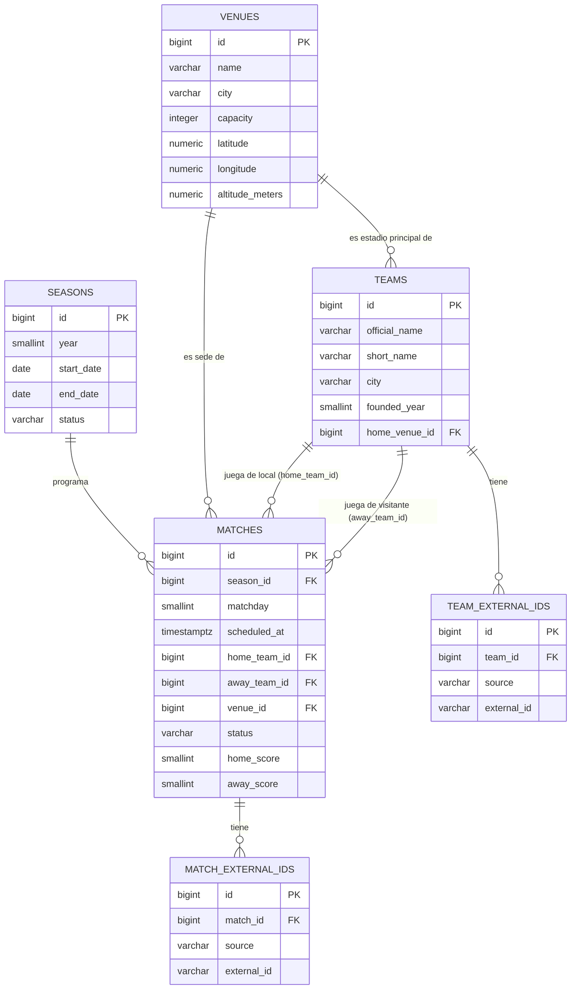

# Esquema Core de Base de Datos — Paso 1.1

## Alcance

Este documento define únicamente las tablas **fundacionales** del esquema relacional:
`teams`, `seasons`, `venues`, `matches`, más dos tablas de soporte para el mapeo de IDs
externos (`team_external_ids`, `match_external_ids`) que surgen de una decisión de diseño
explicada abajo. **No** es el esquema completo de 8 capas del plan maestro — el resto se
agrega en fases posteriores a medida que se ingieren esos datos (clima, distancias, cuotas,
features, etc.).

Es puramente un documento de diseño: no hay SQL, migraciones de Alembic ni modelos
SQLAlchemy todavía. Eso es Paso 1.2 y 1.3 respectivamente, y no deberían implementarse hasta
que este diseño esté validado.

## Resolución de IDs externos multi-fuente

**Decisión: tabla separada (`team_external_ids`, `match_external_ids`) en vez de columnas
dedicadas (`fd_org_id`, `api_football_id`, ...) en `teams`/`matches`.**

Justificación: agregar una columna por fuente (`fd_org_id`, `api_football_id`,
`odds_api_id`, ...) funciona con dos fuentes, pero el plan maestro ya prevé sumar The Odds
API en Fase 3 y no descarta scraping puntual más adelante — cada fuente nueva implicaría una
migración de Alembic para agregar una columna a una tabla core, con el riesgo de dejar
columnas NULL en cascada para todos los registros históricos que no tengan esa fuente. Una
tabla de mapeo (`entity_id, source, external_id`) permite sumar fuentes sin tocar el esquema
de `teams`/`matches`, soporta que una fuente todavía no tenga ID asignado para una entidad
sin ensuciar la tabla principal con NULLs, y además sirve como registro auditable de
"de dónde salió este ID" (útil para depurar inconsistencias entre fuentes en Fase 2.4). El
costo es un JOIN extra al resolver un ID externo → entidad interna, que es aceptable dado que
no es una operación de path caliente (se usa en ingesta, no en serving de predicciones).

## Tablas

### `teams`

| Columna | Tipo | Nullable | Key | Descripción |
|---|---|---|---|---|
| `id` | BIGINT | NO | PK | Identificador interno, generado por la base. |
| `official_name` | VARCHAR(150) | NO | | Nombre oficial completo del club (ej. "Sport Club Corinthians Paulista"). |
| `short_name` | VARCHAR(50) | NO | | Nombre corto/popular usado en tablas y UI (ej. "Corinthians"). |
| `city` | VARCHAR(100) | NO | | Ciudad sede del club. |
| `founded_year` | SMALLINT | YES | | Año de fundación, si está disponible en la fuente. |
| `home_venue_id` | BIGINT | YES | FK → `venues.id` | Estadio principal. Nullable porque puede no conocerse al momento de crear el equipo. |

### `team_external_ids`

| Columna | Tipo | Nullable | Key | Descripción |
|---|---|---|---|---|
| `id` | BIGINT | NO | PK | Identificador interno del mapeo. |
| `team_id` | BIGINT | NO | FK → `teams.id` | Equipo interno al que corresponde este ID externo. |
| `source` | VARCHAR(30) | NO | | Fuente externa: `football_data_org`, `api_football`, `odds_api`, etc. |
| `external_id` | VARCHAR(50) | NO | | ID del equipo tal como lo expone esa fuente. Se guarda como texto porque no todas las fuentes usan enteros. |

Constraints: `UNIQUE(team_id, source)` (un equipo tiene a lo sumo un ID por fuente),
`UNIQUE(source, external_id)` (un ID de una fuente dada mapea a un único equipo interno).

### `seasons`

| Columna | Tipo | Nullable | Key | Descripción |
|---|---|---|---|---|
| `id` | BIGINT | NO | PK | Identificador interno. |
| `year` | SMALLINT | NO | UNIQUE | Año calendario de la temporada (el Brasileirão corre dentro de un único año, ej. 2026). |
| `start_date` | DATE | NO | | Fecha de inicio de la temporada. |
| `end_date` | DATE | YES | | Fecha de fin. Nullable mientras la temporada está en curso. |
| `status` | VARCHAR(20) | NO | | `planned` / `in_progress` / `finished`. |

### `venues`

| Columna | Tipo | Nullable | Key | Descripción |
|---|---|---|---|---|
| `id` | BIGINT | NO | PK | Identificador interno. |
| `name` | VARCHAR(150) | NO | | Nombre del estadio. |
| `city` | VARCHAR(100) | NO | | Ciudad donde está ubicado. |
| `capacity` | INTEGER | YES | | Capacidad de público, si se conoce. |
| `latitude` | NUMERIC(9,6) | NO | | Para cálculo de distancias vía Google Maps en Fase 3. |
| `longitude` | NUMERIC(9,6) | NO | | Ídem. |
| `altitude_meters` | NUMERIC(6,1) | YES | | Altitud sobre el nivel del mar. Relevante como posible feature de condiciones extremas de sede (ej. Cuiabá) en Fase 3/5. |

### `matches`

| Columna | Tipo | Nullable | Key | Descripción |
|---|---|---|---|---|
| `id` | BIGINT | NO | PK | Identificador interno. |
| `season_id` | BIGINT | NO | FK → `seasons.id` | Temporada a la que pertenece el partido. |
| `matchday` | SMALLINT | NO | | Jornada/ronda dentro de la temporada. |
| `scheduled_at` | TIMESTAMPTZ | NO | | Fecha y hora programada, almacenada con timezone (convención: se persiste en UTC; la conversión a hora local de cada sede se hace en capas superiores). Importante porque Brasil abarca varios husos horarios. |
| `home_team_id` | BIGINT | NO | FK → `teams.id` | Equipo local. |
| `away_team_id` | BIGINT | NO | FK → `teams.id` | Equipo visitante. |
| `venue_id` | BIGINT | YES | FK → `venues.id` | Sede del partido. Nullable si el fixture se crea antes de confirmarse la sede. |
| `status` | VARCHAR(20) | NO | | `scheduled` / `finished` / `postponed` / `cancelled`. Default `scheduled`. |
| `home_score` | SMALLINT | YES | | Nullable hasta que el partido termine. |
| `away_score` | SMALLINT | YES | | Ídem. |

Constraints propuestas: `CHECK (home_team_id <> away_team_id)`, y un constraint único
tentativo `UNIQUE (season_id, matchday, home_team_id, away_team_id)` para detectar
duplicados al ingerir de múltiples fuentes — **con la salvedad discutida en "Preguntas
abiertas" de que este supuesto puede romperse en casos reales** (partidos re-disputados por
decisión administrativa), así que no debe tratarse como una garantía absoluta sin
validación adicional a nivel aplicación.

### `match_external_ids`

Mismo patrón que `team_external_ids`, aplicado a partidos por la misma razón (multi-fuente
escalable sin tocar el esquema core).

| Columna | Tipo | Nullable | Key | Descripción |
|---|---|---|---|---|
| `id` | BIGINT | NO | PK | Identificador interno del mapeo. |
| `match_id` | BIGINT | NO | FK → `matches.id` | Partido interno al que corresponde este ID externo. |
| `source` | VARCHAR(30) | NO | | Fuente externa: `football_data_org`, `api_football`, `odds_api`, etc. |
| `external_id` | VARCHAR(50) | NO | | ID del partido tal como lo expone esa fuente. |

Constraints: `UNIQUE(match_id, source)`, `UNIQUE(source, external_id)`.

### ⚠️ Anti-leakage (regla no negociable de CLAUDE.md)

`matches` es la única fuente de verdad de resultados y calendario. **Ninguna tabla derivada
que dependa de "estado a la fecha X"** (tabla de posiciones, forma reciente, ELO, racha,
etc.) se guarda acá como snapshot mutable. Esas tablas se calculan en Fase 5 a partir de
`matches`, filtrando siempre por partidos con `scheduled_at` anterior a la fecha de corte del
partido que se está prediciendo. No existe ni existirá una columna tipo
`current_position` o `current_form` en `teams` — eso sería, por construcción, una fuga de
información del futuro hacia el pasado.

## Diagrama ER

## Preguntas abiertas / decisiones que requieren validación

1. **Ascenso/descenso de equipos**: `teams` no está atada a una temporada ni a una división
   (la participación en una temporada de Série A queda implícita por aparecer en `matches`
   de esa `season_id`). Esto resuelve naturalmente el caso de un equipo que desciende y
   vuelve a subir — sigue siendo el mismo `id`. Pero: **¿necesitamos una tabla explícita
   `season_teams` (participantes confirmados de cada temporada)**, en vez de inferir
   participación solo a partir de si el equipo tiene partidos cargados? Sin ella, no hay
   forma de distinguir "este equipo no jugó Série A esta temporada" de "todavía no cargamos
   sus partidos".

2. **Cambio de nombre o fusión de clubes**: si un club cambia de nombre oficial (ha pasado
   en el fútbol brasileño) o se fusiona con otro, `teams.official_name` tal como está
   diseñado se sobrescribiría in-place, perdiendo la referencia histórica correcta para
   partidos viejos. ¿Versionamos nombres (tabla `team_name_history` con rango de vigencia) o
   aceptamos que el nombre actual se aplica retroactivamente a todo el historial? Es una
   decisión de negocio, no la resolví.

3. **Duplicados en `matches` por reprogramación o partidos re-disputados**: el constraint
   único propuesto `(season_id, matchday, home_team_id, away_team_id)` asume que un mismo
   par local/visitante no se repite dentro de la misma jornada. Esto puede romperse: el
   Brasileirão tiene precedentes de partidos anulados y re-disputados por decisión del STJD
   (ej. escándalo de manipulación de resultados en 2005, con partido replayed). Si eso
   vuelve a pasar, el constraint tal como está rechazaría el segundo partido como duplicado
   cuando en realidad es un partido distinto. No decidí cómo resolverlo (¿constraint más
   laxo + resolución manual, ¿campo `replay_of_match_id`?) — queda para validar antes de
   escribir la migración en 1.2.

4. **Deduplicación *entre* fuentes**: `match_external_ids`/`team_external_ids` resuelven
   "¿este ID de football-data.org ya lo tengo mapeado?", pero no resuelven el problema más
   difícil de "¿este partido de API-Football es el mismo que ya ingerí desde
   football-data.org, si nunca tuve su ID de esa fuente?" — eso requiere
   heurística de matching (mismas fecha/equipos ± tolerancia), que es justamente lo que ya
   está listado como Fase 2.4 ("Normalización de nombres/IDs entre fuentes"). Lo dejo
   explícito acá para que no se asuma que las tablas de mapeo ya resuelven esa parte.

5. **`latitude`/`longitude` como NOT NULL en `venues`**: el prompt las pide sin marcarlas
   nullable, así quedaron. Pero en la práctica, un fixture puede llegar con el nombre de una
   sede que todavía no geocodificamos. ¿La ingesta debe geocodificar de forma síncrona antes
   de insertar el `venue` (bloqueante), o permitimos insertar con coordenadas pendientes y
   flaggear el registro para completar después? No lo decidí — afecta el diseño del pipeline
   de Fase 2/3, no solo el esquema.

6. **`matches.status` y resultados administrativos (W.O.)**: un partido decidido por
   walkover/sanción administrativa (3-0 técnico) queda indistinguible de un resultado
   jugado si solo usamos `finished` + `home_score`/`away_score`. Para un modelo de goles
   esperados, mezclar ambos casos sin distinción podría meter ruido. ¿Agregamos un flag
   tipo `decided_by_admin` o un valor de `status` adicional? Queda para Fase 4
   (calidad de datos) pero prefiero dejarlo anotado ahora que estamos diseñando el esquema
   base, en vez de tener que migrarlo después.
